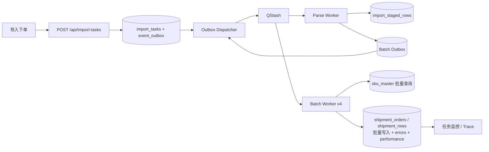

# V4 架构与接口

上传接口只执行文件接收、SHA-256 和事务建任务，行数复用 V2 预览阶段已经得到的 `totalRows`，不在提交请求中再次解析文件。正式规则解析在 Parse Worker 中执行一次。批次 Worker 不读取原文件，避免 20 个批次重复解析 20 次。用户修改过预览数据时，上传接口保存 `confirmedRows`，Parse Worker 仍执行原规则并以用户确认结果作为最终暂存输入，避免异步化后丢失在线编辑。

生产部署先执行 `npm run db:migrate`。V4 请求路径默认禁止运行 DDL，避免 Serverless 冷启动时建表拖慢上传 P95；`ALLOW_RUNTIME_SCHEMA_MIGRATION=true` 仅作为临时兼容开关。

## 状态机

`pending → processing → completed | partial_success | failed`

- 所有批次成功：completed。
- 至少一行失败但有批次正常完成：partial_success。
- 系统错误重试耗尽：failed。
- Worker 原子抢占保证同一批次只有一个消费者生效。

## 错误码

E001 SKU 不存在；E002 必填缺失；E003 电话错误；E004 数量非正数；E005 外部编码重复；E006 规则映射失败；E007 数据库写入失败；E008 文件格式不支持；E009 SKU 校验降级。

## 故障恢复

- Dispatcher 查询 `pending/failed + next_retry_at`，最多重试 5 次，指数退避上限 60 秒。
- QStash 消息重试 3 次并强制签名验证。
- 处理单元失败可重新抢占，最多 3 次。
- Parse Worker 和批次 Worker 都有原子抢占及最多 3 次重试。
- `/api/import-cron/recover` 扫描超过 5 分钟无进展的解析及批次任务，事务写入恢复 Outbox；重试耗尽则进入失败终态。
- Trace ID 贯穿 API、Outbox、队列、解析、批次、错误和性能日志。

## 事件契约

统一事件信封包含 `event_id / event_type / schema_version / aggregate_id / trace_id / occurred_at / payload`。队列消费 `ImportTaskCreated` 和 `ImportBatchCreated`；Worker 将 `ImportBatchStarted / ImportBatchSucceeded / ImportBatchFailed / ImportTaskCompleted / ImportTaskPartialSuccess / ImportTaskDegraded` 以相同版本化信封写入 Trace。消费者仅校验必需字段并忽略新增字段，语义不兼容时升级 `schema_version`。

## 可观测性

- 文件解析与规则执行分位数来自 `import_tasks`，避免非首批次零值污染统计。
- SKU 校验、真实运单批量写入和批次总耗时来自 `batch_performance_log`。
- `/api/traces` 支持 task、trace、文件名、批次、行号范围和错误码组合检索。
- 看板显示错误占比、错误分页、慢批次、失败任务、队列积压和 Outbox 重试耗尽告警。
